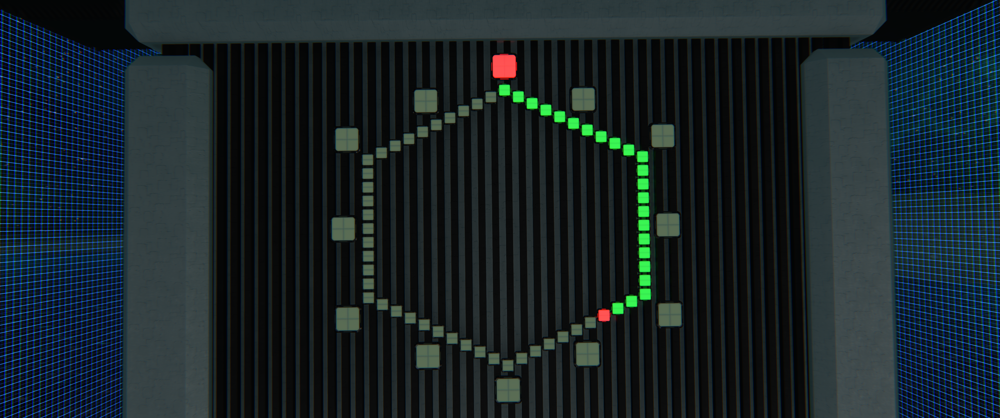
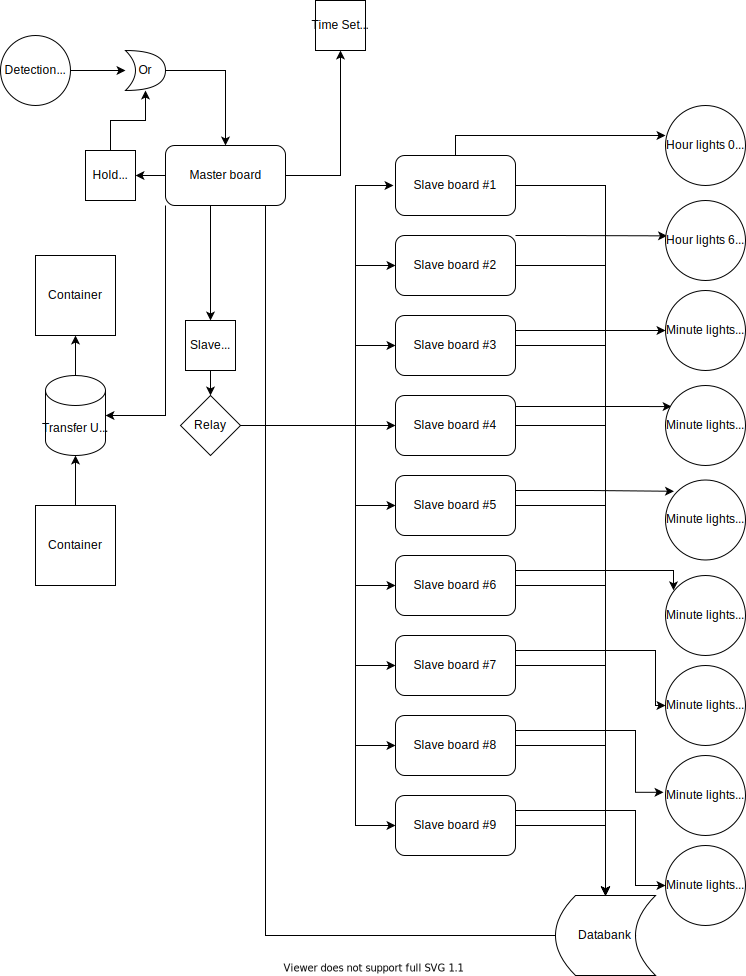

# du-clock

An analog clock for Dual Universe with hour, minute and even seconds if desired.

## Setup instructions

- Link elements as in the schematic. Make sure to link the hour and minute lights in ascending order.
- Load `master.json` into the first master programming board.
- Load `slave.json` into the remaining programming boards, setting the Lua parameter `unitNumber` as per the schematic.

### Setting the time
 
1. Activate the `Time Set Switch` 
2. Activate the `Master Programming Board`

The clock will now show the time of your local client regardless of which player activates it.

Don't turn off the transfer unit unit or you will have to redo the setup process.
